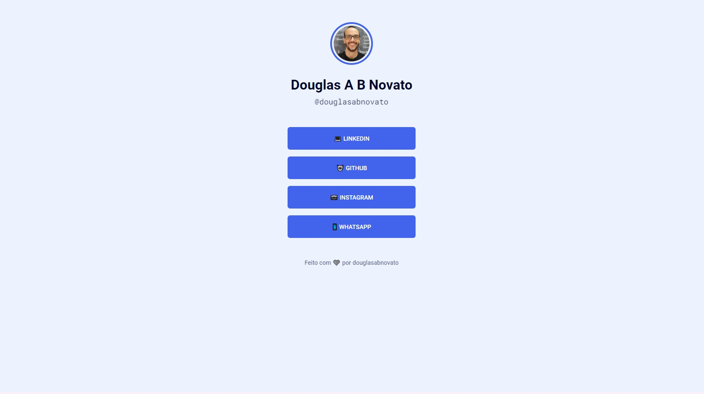
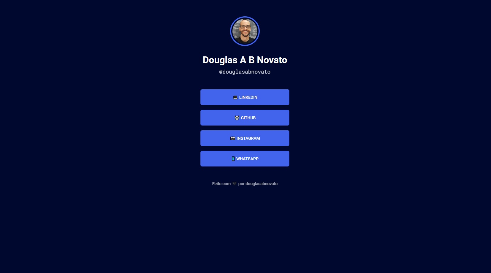
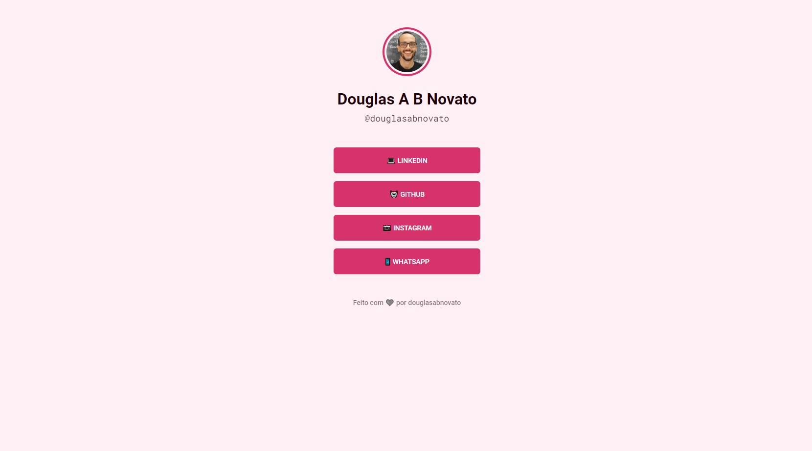

<h4 align="center"> 
	🚧 Links Card 🚀
</h4> 

<h1 align="center">
    
</h1>

- Aplicação de um cartão virtual com os links mais importantes que deseja compartilhar.

- Para desenvolver essa aplicação foi utilizado as tecnologias
    - html e css
    - git e github
    - vscode e extensões
    - Google Chrome e Ferramentas de Desenvolvedor

- Para estilizar essa aplicação foi utilizado o design apresentado no  [Figma](https://www.figma.com/file/DGne5amBdaAnqxxSJPJQ8H/Rocket-Links---Maratona-Explorer-2.0-(Community)?node-id=0%3A1)

- Detalhes do projeto podem ser encontrados no [Notion](https://efficient-sloth-d85.notion.site/Maratona-Explorer-2-0-7ed52d87338e472e9fc7c25180ca933f)

- Etapas
    - construturar a estrutura do html com elementos do layout
    - estilização com as referências de fonts, cores e posicionamento do figma
    - estratégia de variáveis no css
        - personalização cor standard
        - personalização cor dark-blue (body class="dark-blue") 
        - personalização cor pink (body class="pink")

- [x] Terminado essa versão da aplicação

  
  
  

 